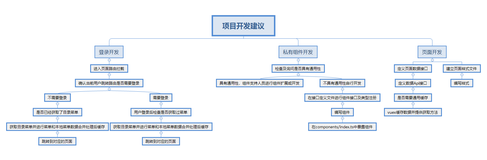

# lensyn-ts
Vue development package for developing large projects based on asynchronous loading module mechanism based on Routing.The development language is Typescript.

# Vue前端构架-结构目录及使用说明

## 浏览器兼容说明

1. 整体架构支持 >= IE9;
2. 最佳体验 >= IE10+

## WEB技术栈

架构于 vue2.5 + vue-router + vuex + axios + Typescript + webpack3.0 + gulp
1. vue2.5 主体架构
2. vue-router 异步路由加载器
3. vuex 数据仓库
4. axios 数据异步请求方式
5. Typescript 开发库
6. webpack 模块化架构工具
7. gulp 代码检测及压缩、打码构建工具

## demo库需要注意的事情
1. 在实际项目开发中需要修改pages/home/Index.vue到自己的业务首页；
2. 修改路由router/index.ts文件中的Demo.ts去掉；
3. 删除或屏蔽styles/main.less;

## 整体开发流程及开发建议导图



## 目录结构说明

```
├── lensyn-ts/                        （项目名字）
├    ├── checkDir/                    （代码检查结果目录）
├    ├── devPkg/                      （项目开发目录，存放vue、vuex开发文件的地方）
├    ├    ├── api/                    （存放本项目所有数据请求方法)
├    ├    ├── components/             （存放本项目自定义的组件)
├    ├    ├    ├── directive.ts       （定义本项目自定义指令）
├    ├    ├    ├── filter.ts          （定义本项目自定义过滤器）
├    ├    ├    ├── index.ts           （项目私有组件导出配置文件）
├    ├    ├    ├── lensyn-global.ts   （本项目指令、过滤器注册配置文件）
├    ├    ├    ├── Menu.vue           （项目menu菜单树，不允许删除，可以不引用）
├    ├    ├    ├── Navigator.vue      （项目导航栏，不允许删除，根据自己项目的特性进行修改适配）
├    ├    ├── config/                 （配置文件存在路径，数据以 data.ts)
├    ├    ├    ├── const.config.ts    （项目静态变量配置文件，不允许删除）
├    ├    ├    ├── index.ts           （项目静态资源导出文件，不允许删除）
├    ├    ├    ├── menu.data.ts       （项目menu菜单数据，不允许删除）
├    ├    ├    ├── moke.data.ts       （项目模拟数据，不允许删除）
├    ├    ├    ├── url.config.ts      （项目url的配置文件，不允许删除）
├    ├    ├── images/                 （图片存放目录)
├    ├    ├    ├── common/            （通用图片，不允许删除）
├    ├    ├── pages/                  （图片存放目录)
├    ├    ├    ├── home/              （首页，项目自定义目录）
├    ├    ├    ├── layout/            （默认模板，不允许删除）
├    ├    ├    ├── login/             （默认登录，不允许删除，可以自定义修改或不使用）
├    ├    ├    ├── BaseView.vue       （基础试图组件，主要提供通用方法，不允许删除，可以自定义修改或不使用）
├    ├    ├    ├── Index.vue          （所有界面的入口，不允许删除，可以自定义修改或不使用）
├    ├    ├── router/                 （图片存放目录)
├    ├    ├    ├── Home.ts            （项目自定义路由）
├    ├    ├    ├── index.ts           （项目路由及菜单和用户权限管理文件，不允许删除，可以自定义修改或不使用）
├    ├    ├    ├── Login.ts           （项目自定义登录路由，不允许删除，可以自定义修改或不使用）
├    ├    ├── store/                  （图片存放目录)
├    ├    ├    ├── common.ts          （项目通用数据仓库）
├    ├    ├    ├── index.ts           （项目数据仓库导出文件，不允许删除，可以自定义修改）
├    ├    ├── styles/                 （样式文件存放目录)
├    ├    ├    ├── common/            （项目通用样式库，不允许删除）
├    ├    ├    ├    ├── index.less    （项目通用样式定义，不允许删除，可以自定义修改）
├    ├    ├    ├    ├── index-media   （项目通用样式媒体定义，不允许删除，可以自定义修改）
├    ├    ├    ├    ├── index-personal（项目通用个性化样式定义，不允许删除，可以自定义修改）
├    ├    ├    ├── login/             （项目登录样式，不允许删除，可以自定义修改）
├    ├    ├    ├── base.less          （项目基础样式，不允许删除和修改）
├    ├    ├    ├── common.less        （项目通用样式定义文件，不允许删除，可以自定义修改）
├    ├    ├    ├── component.less     （项目私有组件或组件样式重写，不允许删除，可以自定义修改）
├    ├    ├    ├── main.less          （项目样式导出文件，不允许删除，可以自定义修改）
├    ├    ├── types/                  （TS类型/接口定义文件目录)
├    ├    ├    ├── common.d.less      （项目通用及自定义组件接口、类型定义文件，不允许删除，可以自定义修改）
├    ├    ├── util/                   （业务逻辑的目录）
├    ├    ├    ├── ...                （文件目录结构大致上对应componets目录结构）
├    ├    └── main.ts                 （入口及样式、组件、路由、指令、过滤器导入文件，基础vue，不允许删除）
├    ├    └── vue-shim.d.ts           （Vue TS定义及通用基础定义，不允许删除）
├    ├── static/                      （静态资源文件目录）
├    ├    ├── assets                  （所有图片文件，不允许私自添加图片到此目录）
├    ├    ├    ├── font               （所有字体库文件）
├    ├    ├    ├── font.css           （所有字体库字体定义文件，仅定义字体，不允许书写样式到此文件）
├    ├    ├── images                  （所有图片文件，不允许私自添加图片到此目录）
├    ├    ├── style                   （所有样式文件，不允许私自添加样式到此目录）
├    ├    ├── favicon.ico             （项目私有偏好图片，与页面的title图标一致）
├    ├── .babelrc                     （babel-loader依赖配置文件）
├    ├── .eslintrc.js                 （eslint文件检查规则配置文件）
├    ├── .gitignore                   （git提交忽略文件）
├    ├── .stylelintrc                 （样式eslint检查规则配置文件）
├    ├── ChunkCleanPlugin.js          （打包前删除static本地缓存文件插件）
├    ├── gulpfile.js                  （gulp压缩、合并、打码配置文件）
├    ├── index.html                   （项目首页主入口）
├    ├── package.json                 （项目所有依赖及执行命令配置文件）
├    ├── tsconfig.json                （TS解析规则配置文件）
├    ├── tslint.json                  （TS eslint检查规则配置文件）
├    ├── webpack.config.js            （webpack打包、语言解析、图片解析、样式编译配置文件）
```
## 项目结构说明：

1. 在进行项目开发前，请仔细阅读目录结构图和整体开发规则文件，表明不能修改、删除的文件一定需要保留；
2. 整个项目属于单页面开发，所有路由都在入口文件（router/index.ts）中进行配置，单独页面功能自行创建新目录进行配置开发；
3. 编译后的文件都存放在dist文件夹，前端发包以dist为准；
4. 所有通用、多页面公用资源缓存在Vuex中，按功能进行文件管理，所有功能文件放在（store/**.ts）文件夹下，在index.ts中进行配置；
5. 所有页面功能开发按功能模块包管理方式并以.vue文件存在；
6. 所有私有组件、指令、过滤器都定义在components文件夹；
7. 组件的使用和现有组件整理在https://github.com/lensyn-ui/lensyn-ui dev分支；

## 项目环境安装与运行
1. 安装开发库：
 `git clone https://github.com/lensyn-ui/lensyn-ts.git`
2. 安装依赖：(需要跳转到对应的项目文件路径，开发环境依赖node8.X LTS版本，需要安装，不能用10.X版本，有兼容问题)
 `npm install`
3. 运行项目：(运行前确保依赖安装完成且无失败项)
 `npm run start`
4. 打包发布命令：(发布规则为，只发布dist目录所有文件，nginx指向也指向文件所在目录)
 `npm run deploy`
